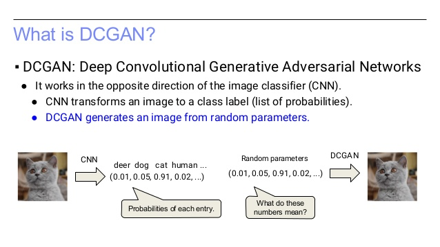
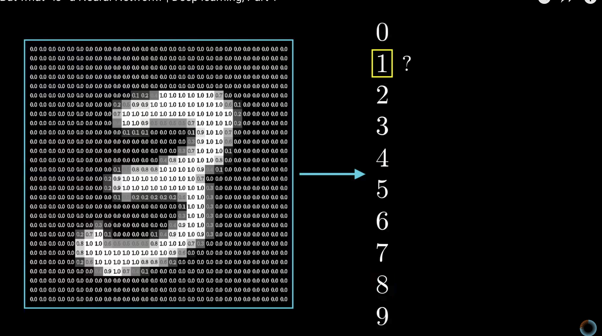
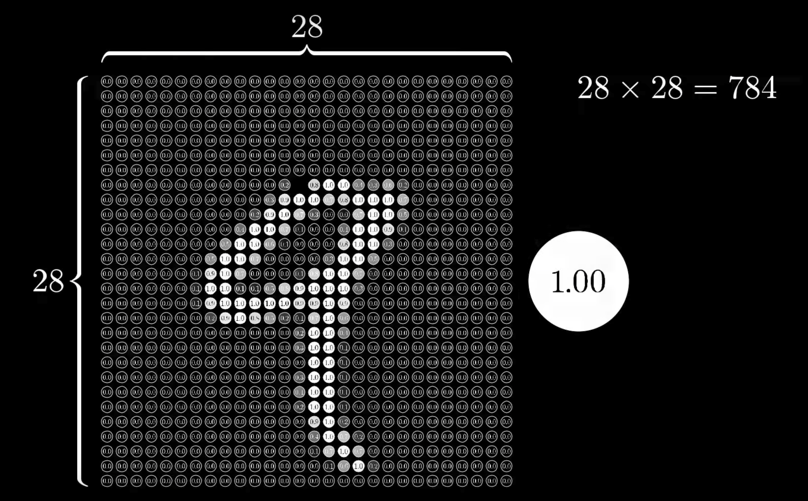
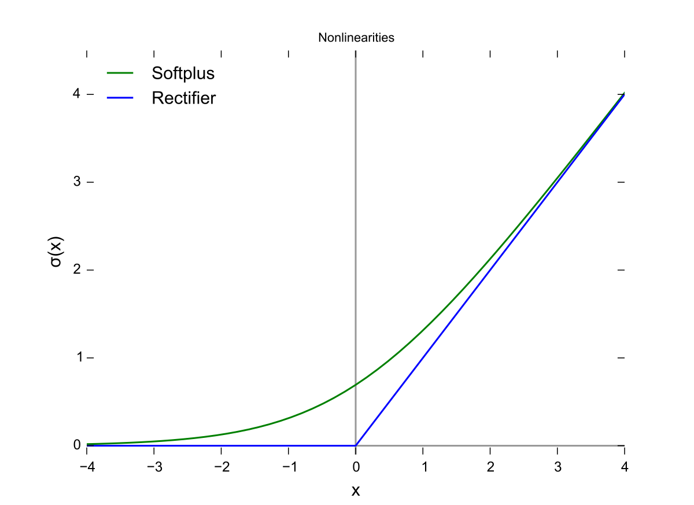
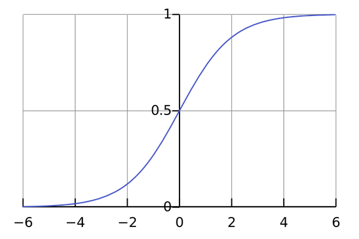

# Momentum-AI-machine-learning-course
This Momentum AI's machine learning courses, teaches you how to work with the latest technologies in deep learning.

Learn more at http://momentum-ai.com

Google Document with overview on how to get started with deep learning.
https://docs.google.com/document/d/1TOC41vbdTZpyzM6nz7KV6v_S4W_KfpK4EMQ-LUAkki4/edit

Presentation regarding AI and Machine Learning.
https://docs.google.com/presentation/d/1kKbz2truGhtTaXUwfTi1A-KocBFbhCGQM3PKDzY_BoY/edit?usp=sharing

The course will teach you how to work with different machine learning models with focus on artificial neural networks.
You will learn how to build your own artificial neural network from scratch and how to use Tensorflow and Keras to create
machine learnings models that can create language and understand vision. The course will also focus on how to get your trained model up and working on the web.


# [Part 1 Getting started with AI](https://github.com/bcarlyle/Momentum-AI-machine-learning-course/blob/master/lesson1/Getting%20started%20with%20AI.ipynb)

## Training your first artificial neural network

In the first lesson you will learn how to get started with deep learning using Keras and Tensorflow. You get to train your own deep neural network that works wih brain imaging data.

Here is the code for a deep neural network in Keras. Exciting stuff!


```python


# Visualize training history
from keras.models import Sequential
from keras.layers import Dense, BatchNormalization
from keras.layers import Dropout
from keras.optimizers import RMSprop
from keras import optimizers
import matplotlib.pyplot as plt
import pandas as pd
import numpy as np
import numpy
import keras

# Remove warnings
import warnings
warnings.filterwarnings('ignore')

# fix random seed for reproducibility
seed = 7
numpy.random.seed(seed)

dataset = pd.read_csv("https://www.floydhub.com/viewer/data/res7UHjG5WSPgPStBT84xW/ID-OXY-20.csv")
# split into input (X) and output 󰀀 variables

# Remove missing values
dataset = dataset.dropna()

# make a label dataset
dataset["Label"] = dataset["Mark"]

# change rest values to 
# default mode
dataset["Mark"][dataset["Mark"] == "REST"] = 0
# task positive network
dataset["Mark"][dataset["Mark"] == "ADDITION"] = 1
dataset["Mark"][dataset["Mark"] == "PASSTHOUGHT"] = 2
dataset["Mark"][dataset["Mark"] == "JUNK"] = 3

# remove the JUNK data
dataset = dataset[dataset.Mark != 2]
dataset = dataset[dataset.Mark != 3]

# shuffle the data
dataset = dataset.sample(frac=1)

# 52 broadmann areas data
X = np.array(dataset.ix[:, :'CH52'])
# default mode network or task positive network
Y = np.array([[1,0] if i == 0 else [0,1] for i in dataset.Mark])

# Dropout - the number of neurons removed at each layers, who are readded when testing
# Batch size - the number of data points added at each time, affects training time
# Epochs - the number of training/test sessions

# create model
model = Sequential()

# makes the values between 0 and 1
model.add(BatchNormalization(input_shape=(52,)))
model.add(Dropout(0.3))
model.add(Dense(100, init="normal", activation='relu'))
model.add(Dropout(0.3))
model.add(Dense(100, init="normal", activation='relu'))
model.add(Dropout(0.3))
model.add(Dense(100, init="normal", activation='relu'))

model.add(Dense(2, init="normal", activation='softmax'))
# Compile model
model.compile(loss='mean_squared_error', optimizer='adam', metrics=['accuracy'])
# Fit the model
history = model.fit(X, Y, validation_split=0.5, nb_epoch=50, batch_size=50, verbose=1)
# list all data in history
print(history.history.keys())
# summarize history for accuracy
plt.plot(history.history['acc'])
plt.plot(history.history['val_acc'])
plt.title('model accuracy')
plt.ylabel('accuracy')
plt.xlabel('epoch')
plt.legend(['train', 'test'], loc='upper left')
plt.show()
# summarize history for loss
plt.plot(history.history['loss'])
plt.plot(history.history['val_loss'])
plt.title('model loss')
plt.ylabel('loss')
plt.xlabel('epoch')
plt.legend(['train', 'test'], loc='upper left')
plt.show()


    
   ```
## [Hello world](https://github.com/bcarlyle/Momentum-AI-machine-learning-course/blob/master/lesson1/Hello%20world.ipynb)

Example of the hello world of machine learning using MNIST.

## Part 2 Machine Learning on mobile

In the second lesson we work on getting a machine learning model working on a mobile phone.

## [Part 3 General adversarial networks and style transfer](https://github.com/bcarlyle/Momentum-AI-machine-learning-course/blob/master/lesson3/)

## Using neural networks for making art. 


Generative adversarial networks (GANs) are a class of artificial intelligence algorithms used in unsupervised machine learning, implemented by a system of two neural networks contesting with each other in a zero-sum game framework. They were introduced by Ian Goodfellow et al. in 2014,[1] although the idea of adversarial training dates back to Jürgen Schmidhuber in 1992.[2]

## How does a GAN learn?

A general adverserial network are two neural networks, one generator and one discriminator. The job of the generator is to create stimuli that can fool the discriminator.



The DCGAN network takes as input 100 random numbers drawn from a uniform distribution (we refer to these as a code, or latent variables, in red) 
and outputs an image (in this case 64x64x3 images on the right, in green). 
As the code is changed incrementally, the generated images do too — this shows the model 
has learned features to describe how the world looks, 
rather than just memorizing some examples.
The network (in yellow) is made up of standard convolutional neural network components, such as deconvolutional layers (reverse of convolutional layers), fully connected layers, etc.:


## Part 4 The math of deep learning

# The math of deep learning

> What I cannot create, I do not understand - Richard Feynman 


Richard Feynman who is considered one of the greatest scientists who ever lived had something scribbled on his blackboard at the time of his death.

What I cannot create I do not understand.

So this time we will create in order to understand.

# Math in deep learning
Deep learning draws math from three different sources, linear algebra, calculus and statistics. 
## Linear algebra
http://machinelearningmastery.com/linear-algebra-machine-learning/
## Calculus
https://www.umiacs.umd.edu/~hal/courses/2013S_ML/math4ml.pdf
## Statistics
http://machinelearningmastery.com/crash-course-statistics-machine-learning/
Neural network from scratch


## X and Y
X is the input to the neural network




# Backprop

## Gradient descent


## Objective functions (Loss function)

### Derivatives

### Chain rule

4 + w1 = 5

loss equals 1

4 + w2 = 3

loss equals -1


# Forward prop

## Activation function

### Sigmoid


### Relu


### Softmax


### Non-linear relationships

## Weight multiplication

w*x


## Initialisation

kx + m = y
w*x + b = y

w1*x1

w1*x1 + b

## Universal function approximator

### LSTM = Turing Machine


## Normalization

Normalizisation of input values to avoid feature scaling

Normalization of output valies to have fun


# Have fun

## Part 5 Deep learning and neuroscience
# Towards a mathematical understanding of the mind

It makes sense to argue that the reason why deep learning algorithms work is because they are similar to how the brain computes information
But to get started it might be good for us to understand, how does the human brain work and process information?In recent years, theories that view the brain as a machine that process information has grown in influence. 

The most groundbreaking work is the entropic brain theory, that argues that the primary purpose of the human brain is to reduce entropy (uncertainty) in our environment.

https://www.ncbi.nlm.nih.gov/pmc/articles/PMC3909994/

Recent work has indeed supported the notion that brain activity is slightly sub-critical in normal waking consciousness (Priesemann et al., 2013). One reason why it may be advantageous for the brain to operate just below criticality is that by doing so, it can exert better control over the rest of the natural world—most of which is critical. This may take the form of suppressing endogenous processes within the brain or interacting with the environment in order to shape it and thereby control it. Indeed, if control is the objective, then it makes sense that the brain should be more ordered than that which it wishes to control.

The idea that the brain is closer to criticality in the psychedelic state than in normal waking consciousness (Figure ​(Figure7)7) has some intuitive appeal as some of the signatures of criticality, such as maximum metastability, avalanche phenomena and hypersensitivity to perturbation are consistent with the phenomenology of the psychedelic state. For example, if we consider just one of these: hypersensitivity to perturbation, it is well known that individuals are hypersensitive to environmental perturbations in the psychedelic state, which is why such emphasis is placed on the importance of managing the environment in which the psychedelic experience unfolds (Johnson et al., 2008). Indeed, one explanation for why some people celebrate and romanticize the psychedelic experience and even consider it “sacred” (Schultes, 1980; McKenna, 1992), is that, in terms of criticality, brain activity does actually become more consistent closer with the rest of nature in this state i.e., it moves closer to criticality-proper and so is more in harmony with the rest of nature.

A final speculation that is worth sharing, is that the claim that psychedelics work to lower repression and facilitate access to the psychoanalytic unconscious, may relate to the brain moving out of a sub-critical mode of functioning and into a critical one, enabling transient windows of segregation or modularity to occur (e.g., with “anarchic” MTL activity) because of the breakdown of the system's hierarchical structure. Indeed, repression may depend on the brain operating in a sub-critical mode, since this would constrain consciousness and limit its breadth. Phenomena such as spontaneous personal insights and the complex imagery that often plays out in psychedelic state (Cohen, 1967) and dreaming, may depend on a suspension of repression, enabling cascade-like processes to propagate through the brain [e.g., from the MTLs to the association cortices (Bartolomei et al., 2012)]. Such processes may depend on a reduction of DMN control over MTL activity.

## Python fundamentals
The course is taught in Python and it's good to have some familiarity with Python. If Python is new to you, there are Python resources here that can help you get started.

[Python fundamentals](https://github.com/bcarlyle/Momentum-AI-machine-learning-course/blob/master/python_fundamentals/PythonFundamental/PythonFundamentals.ipynb)

[Lists in Python](https://github.com/bcarlyle/Momentum-AI-machine-learning-course/blob/master/python_fundamentals/PythonFundamental/ListsinPython.ipynb)

## Jupyter notebooks
The datascience community loves Python notebooks because they are awesome. They are interactive notebooks where you can run code.
[Download Jupyter Notebook](http://jupyter.org/)

## Python libraries
The following python libraries are used.

## Tensorflow
Main library for handling the back end for machine learning algorithms. 
[Tensorflow](htt://tensorflow.org)

## Keras
API on top of Tensorflow for working with deep neural networks
[Keras](http://keras.io)

## Numpy
For working with arrays

## Pandas
For working with data frames

## Matplotlib
For plotting data


