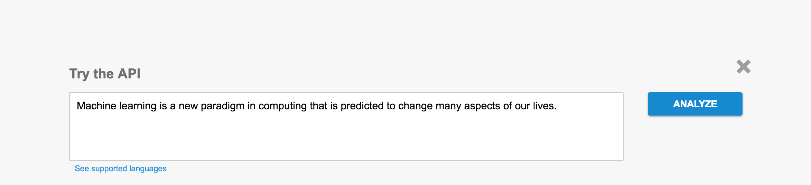

# Machine Learning APIS
There are currently a breadth of machine learning API's available for you.
Google and Amazon are among the companies that host excellent APIs forfor language and image recognition.

# Google machine learning APIs

# Cloud Vision API
Google Cloud Vision API is
a powerful API to use to gain information about images.
https://cloud.google.com/vision/

## Powerful Image Analysis
Google Cloud Vision API enables developers to understand the content of an image by encapsulating powerful machine learning models in an easy to use REST API. It quickly classifies images into thousands of categories (e.g., "sailboat", "lion", "Eiffel Tower"), detects individual objects and faces within images, and finds and reads printed words contained within images. You can build metadata on your image catalog, moderate offensive content, or enable new marketing scenarios through image sentiment analysis. Analyze images uploaded in the request or integrate with your image storage on Google Cloud Storage.

# Trying out the Cloud Vision API
Lets try out the Cloud Vision API by uploading an image. Here is our upload image.


And here is our result.


It looks like the image thinks we are happy.

It also manages to figure out that this is our github profile page picture. Google knows everything.

The properties tab gives us information about the image

The safe search tab gives us information about if this image is safe. 

The JSON tag gives us the result from the classification in a JSON format.


```json

{
  "faceAnnotations": [
    {
      "boundingPoly": {
        "vertices": [
          {
            "x": 114,
            "y": 26
          },
          {
            "x": 239,
            "y": 26
          },
          {
            "x": 239,
            "y": 172
          },
          {
            "x": 114,
            "y": 172
          }
        ]
      },
      "fdBoundingPoly": {
        "vertices": [
          {
            "x": 125,
            "y": 76
          },
          {
            "x": 221,
            "y": 76
          },
          {
            "x": 221,
            "y": 172
          },
          {
            "x": 125,
            "y": 172
          }
        ]
      },
      "landmarks": [
        {
          "type": "LEFT_EYE",
          "position": {
            "x": 156.498,
            "y": 102.61621,
            "z": 0.00048680167
          }
        },
        {
          "type": "RIGHT_EYE",
          "position": {
            "x": 193.4179,
            "y": 107.11897,
            "z": -2.2515647
          }
        },
        {
          "type": "LEFT_OF_LEFT_EYEBROW",
          "position": {
            "x": 144.98402,
            "y": 92.22127,
            "z": 1.1690571
          }
        },
        {
          "type": "RIGHT_OF_LEFT_EYEBROW",
          "position": {
            "x": 166.1567,
            "y": 98.05759,
            "z": -10.52516
          }
        },
        {
          "type": "LEFT_OF_RIGHT_EYEBROW",
          "position": {
            "x": 184.39276,
            "y": 100.08307,
            "z": -11.686228
          }
        },
        {
          "type": "RIGHT_OF_RIGHT_EYEBROW",
          "position": {
            "x": 207.63138,
            "y": 99.21994,
            "z": -2.7312894
          }
        },
        {
          "type": "MIDPOINT_BETWEEN_EYES",
          "position": {
            "x": 174.87532,
            "y": 106.545784,
            "z": -8.977225
          }
        },
        {
          "type": "NOSE_TIP",
          "position": {
            "x": 172.27274,
            "y": 130.3847,
            "z": -12.017959
          }
        },
        {
          "type": "UPPER_LIP",
          "position": {
            "x": 171.71191,
            "y": 139.8089,
            "z": 0.7031856
          }
        },
        {
          "type": "LOWER_LIP",
          "position": {
            "x": 170.59131,
            "y": 152.9205,
            "z": 8.26223
          }
        },
        {
          "type": "MOUTH_LEFT",
          "position": {
            "x": 154.9404,
            "y": 138.94147,
            "z": 13.74621
          }
        },
        {
          "type": "MOUTH_RIGHT",
          "position": {
            "x": 189.4711,
            "y": 142.73766,
            "z": 11.743935
          }
        },
        {
          "type": "MOUTH_CENTER",
          "position": {
            "x": 171.48035,
            "y": 146.1148,
            "z": 5.759666
          }
        },
        {
          "type": "NOSE_BOTTOM_RIGHT",
          "position": {
            "x": 184.03151,
            "y": 129.55252,
            "z": 2.07029
          }
        },
        {
          "type": "NOSE_BOTTOM_LEFT",
          "position": {
            "x": 161.76239,
            "y": 127.22859,
            "z": 3.4602528
          }
        },
        {
          "type": "NOSE_BOTTOM_CENTER",
          "position": {
            "x": 172.20638,
            "y": 133.92496,
            "z": -1.7762357
          }
        },
        {
          "type": "LEFT_EYE_TOP_BOUNDARY",
          "position": {
            "x": 156.46358,
            "y": 101.44154,
            "z": -3.2043357
          }
        },
        {
          "type": "LEFT_EYE_RIGHT_CORNER",
          "position": {
            "x": 163.91718,
            "y": 104.34846,
            "z": -0.13308252
          }
        },
        {
          "type": "LEFT_EYE_BOTTOM_BOUNDARY",
          "position": {
            "x": 155.95317,
            "y": 104.84342,
            "z": 0.52643496
          }
        },
        {
          "type": "LEFT_EYE_LEFT_CORNER",
          "position": {
            "x": 149.34058,
            "y": 101.2061,
            "z": 3.8453772
          }
        },
        {
          "type": "LEFT_EYE_PUPIL",
          "position": {
            "x": 155.79002,
            "y": 103.27655,
            "z": -0.8273093
          }
        },
        {
          "type": "RIGHT_EYE_TOP_BOUNDARY",
          "position": {
            "x": 193.892,
            "y": 105.493286,
            "z": -5.6010056
          }
        },
        {
          "type": "RIGHT_EYE_RIGHT_CORNER",
          "position": {
            "x": 201.70226,
            "y": 106.87177,
            "z": 0.50735325
          }
        },
        {
          "type": "RIGHT_EYE_BOTTOM_BOUNDARY",
          "position": {
            "x": 193.42342,
            "y": 109.55841,
            "z": -1.7798909
          }
        },
        {
          "type": "RIGHT_EYE_LEFT_CORNER",
          "position": {
            "x": 186.0802,
            "y": 106.78269,
            "z": -1.5632201
          }
        },
        {
          "type": "RIGHT_EYE_PUPIL",
          "position": {
            "x": 194.21922,
            "y": 107.474556,
            "z": -3.3303113
          }
        },
        {
          "type": "LEFT_EYEBROW_UPPER_MIDPOINT",
          "position": {
            "x": 155.57951,
            "y": 91.62663,
            "z": -8.630332
          }
        },
        {
          "type": "RIGHT_EYEBROW_UPPER_MIDPOINT",
          "position": {
            "x": 196.1982,
            "y": 96.0206,
            "z": -11.237556
          }
        },
        {
          "type": "LEFT_EAR_TRAGION",
          "position": {
            "x": 135.70645,
            "y": 102.49406,
            "z": 51.64619
          }
        },
        {
          "type": "RIGHT_EAR_TRAGION",
          "position": {
            "x": 220.74554,
            "y": 111.637344,
            "z": 46.249294
          }
        },
        {
          "type": "FOREHEAD_GLABELLA",
          "position": {
            "x": 175.16063,
            "y": 99.06627,
            "z": -12.644047
          }
        },
        {
          "type": "CHIN_GNATHION",
          "position": {
            "x": 169.91621,
            "y": 166.05312,
            "z": 18.58636
          }
        },
        {
          "type": "CHIN_LEFT_GONION",
          "position": {
            "x": 136.4135,
            "y": 130.66023,
            "z": 45.14321
          }
        },
        {
          "type": "CHIN_RIGHT_GONION",
          "position": {
            "x": 213.22795,
            "y": 138.92136,
            "z": 40.229366
          }
        }
      ],
      "rollAngle": 4.8433776,
      "panAngle": -3.8588955,
      "tiltAngle": -19.728199,
      "detectionConfidence": 0.9610714,
      "landmarkingConfidence": 0.48283404,
      "joyLikelihood": "VERY_LIKELY",
      "sorrowLikelihood": "VERY_UNLIKELY",
      "angerLikelihood": "VERY_UNLIKELY",
      "surpriseLikelihood": "VERY_UNLIKELY",
      "underExposedLikelihood": "VERY_UNLIKELY",
      "blurredLikelihood": "VERY_UNLIKELY",
      "headwearLikelihood": "VERY_UNLIKELY"
    }
  ],
  "labelAnnotations": [
    {
      "mid": "/m/0dzct",
      "description": "face",
      "score": 0.950875
    },
    {
      "mid": "/m/04rky",
      "description": "mammal",
      "score": 0.92482233
    },
    {
      "mid": "/m/0k0pj",
      "description": "nose",
      "score": 0.8904967
    },
    {
      "mid": "/m/04hgtk",
      "description": "head",
      "score": 0.860428
    },
    {
      "mid": "/m/05mqq3",
      "description": "snout",
      "score": 0.74990165
    },
    {
      "mid": "/m/019nj4",
      "description": "smile",
      "score": 0.7489622
    },
    {
      "mid": "/m/0dnr7",
      "description": "textile",
      "score": 0.714359
    },
    {
      "mid": "/m/071j9r",
      "description": "cool",
      "score": 0.67405623
    },
    {
      "mid": "/m/0283dt1",
      "description": "mouth",
      "score": 0.6698645
    },
    {
      "mid": "/m/0ds99lh",
      "description": "fun",
      "score": 0.6655329
    },
    {
      "mid": "/m/025rgl",
      "description": "plush",
      "score": 0.64518493
    },
    {
      "mid": "/m/039xj_",
      "description": "ear",
      "score": 0.5680277
    },
    {
      "mid": "/m/0ds5b",
      "description": "facial hair",
      "score": 0.50723356
    },
    {
      "mid": "/m/01jwgf",
      "description": "product",
      "score": 0.5037808
    }
  ],
  "safeSearchAnnotation": {
    "adult": "VERY_UNLIKELY",
    "spoof": "UNLIKELY",
    "medical": "VERY_UNLIKELY",
    "violence": "VERY_UNLIKELY"
  },
  "imagePropertiesAnnotation": {
    "dominantColors": {
      "colors": [
        {
          "color": {
            "red": 29,
            "green": 16,
            "blue": 45
          },
          "score": 0.21823268,
          "pixelFraction": 0.1105957
        },
        {
          "color": {
            "red": 248,
            "green": 239,
            "blue": 198
          },
          "score": 0.08804621,
          "pixelFraction": 0.098083496
        },
        {
          "color": {
            "red": 73,
            "green": 41,
            "blue": 54
          },
          "score": 0.07303277,
          "pixelFraction": 0.07305908
        },
        {
          "color": {
            "red": 213,
            "green": 191,
            "blue": 156
          },
          "score": 0.0823994,
          "pixelFraction": 0.06939697
        },
        {
          "color": {
            "red": 59,
            "green": 39,
            "blue": 67
          },
          "score": 0.05883008,
          "pixelFraction": 0.042053223
        },
        {
          "color": {
            "red": 10,
            "green": 9,
            "blue": 33
          },
          "score": 0.056490295,
          "pixelFraction": 0.036987305
        },
        {
          "color": {
            "red": 247,
            "green": 239,
            "blue": 185
          },
          "score": 0.047916405,
          "pixelFraction": 0.079711914
        },
        {
          "color": {
            "red": 179,
            "green": 155,
            "blue": 129
          },
          "score": 0.045405265,
          "pixelFraction": 0.038391113
        },
        {
          "color": {
            "red": 45,
            "green": 16,
            "blue": 31
          },
          "score": 0.043066144,
          "pixelFraction": 0.028259277
        },
        {
          "color": {
            "red": 105,
            "green": 75,
            "blue": 83
          },
          "score": 0.0426701,
          "pixelFraction": 0.06866455
        }
      ]
    }
  },
  "cropHintsAnnotation": {
    "cropHints": [
      {
        "boundingPoly": {
          "vertices": [
            {
              "x": 31
            },
            {
              "x": 403
            },
            {
              "x": 403,
              "y": 459
            },
            {
              "x": 31,
              "y": 459
            }
          ]
        },
        "confidence": 1,
        "importanceFraction": 0.71999997
      },
      {
        "boundingPoly": {
          "vertices": [
            {},
            {
              "x": 459
            },
            {
              "x": 459,
              "y": 459
            },
            {
              "y": 459
            }
          ]
        },
        "confidence": 1,
        "importanceFraction": 0.75
      },
      {
        "boundingPoly": {
          "vertices": [
            {},
            {
              "x": 459
            },
            {
              "x": 459,
              "y": 385
            },
            {
              "y": 385
            }
          ]
        },
        "confidence": 1,
        "importanceFraction": 0.72999996
      }
    ]
  },
  "webDetection": {
    "webEntities": [
      {
        "entityId": "/m/04g0kcw",
        "score": 0.7271,
        "description": "GitHub"
      },
      {
        "entityId": "/m/02pkdjw",
        "score": 0.6575,
        "description": "Software repository"
      },
      {
        "entityId": "/m/05mqq3",
        "score": 0.41786802,
        "description": "Snout"
      },
      {
        "entityId": "/m/0283dt1",
        "score": 0.20436125,
        "description": "Mouth"
      },
      {
        "entityId": "/m/025rgl",
        "score": 0.1734223,
        "description": "Plush"
      },
      {
        "entityId": "/m/04rky",
        "score": 0.16040733,
        "description": "Mammal"
      },
      {
        "entityId": "/m/039xj_",
        "score": 0.14767376,
        "description": "Ear"
      }
    ],
    "fullMatchingImages": [
      {
        "url": "https://avatars0.githubusercontent.com/u/1704131?s=460&v=4"
      }
    ],
    "pagesWithMatchingImages": [
      {
        "url": "https://github.com/bcarlyle"
      },
      {
        "url": "https://github.com/bcarlyle?tab=following"
      },
      {
        "url": "https://github.com/bcarlyle?tab=followers"
      }
    ],
    "visuallySimilarImages": [
      {
        "url": "https://avatars1.githubusercontent.com/u/5253821?s=460&v=4"
      },
      {
        "url": "https://avatars1.githubusercontent.com/u/195094?s=460&v=4"
      },
      {
        "url": "https://avatars2.githubusercontent.com/u/491675?s=400&v=4"
      },
      {
        "url": "https://avatars0.githubusercontent.com/u/207807?s=460&v=4"
      },
      {
        "url": "https://archive.org/services/img/github.com-ai-tor-DeepGTAV_-_2017-06-01_17-26-11"
      },
      {
        "url": "https://avatars1.githubusercontent.com/u/294415?s=460&v=4"
      },
      {
        "url": "https://avatars2.githubusercontent.com/u/112368?s=460&v=4"
      },
      {
        "url": "https://avatars3.githubusercontent.com/u/200280?s=460&v=4"
      },
      {
        "url": "https://avatars1.githubusercontent.com/u/355886?s=460&v=4"
      },
      {
        "url": "https://avatars3.githubusercontent.com/u/954102?s=460&v=4"
      }
    ]
  }
}
```

# Google Cloud Natural Language
Derive insights from unstructured text using Google machine learning

# Powerful Text Analysis
Google Cloud Natural Language reveals the structure and meaning of text by offering powerful machine learning models in an easy to use REST API. You can use it to extract information about people, places, events and much more, mentioned in text documents, news articles or blog posts. You can use it to understand sentiment about your product on social media or parse intent from customer conversations happening in a call center or a messaging app. You can analyze text uploaded in your request or integrate with your document storage on Google Cloud Storage.

# Trying out the cloud natural language API
Lets try out the natural language API by inputting a sentence.

The entities tab gives us informaiton about the most important entities in the sentence

The sentiment tab determines the emotional tonality of our sentence

The syntax tab gives us detailed information about the syntax of our sentences. 

Our first text was too short but a slightly longer text is able to be categorized into the following categories.


# Google Cloud Speech APi
Speech to text conversion powered by machine learning.

# Powerful Speech Recognition
Google Cloud Speech API enables developers to convert audio to text by applying powerful neural network models in an easy to use API. The API recognizes over 110 languages and variants, to support your global user base. You can transcribe the text of users dictating to an application’s microphone, enable command-and-control through voice, or transcribe audio files, among many other use cases. Recognize audio uploaded in the request, and integrate with your audio storage on Google Cloud Storage, by using the same technology Google uses to power its own products.

The Google Cloud Speech Recognition API can convert speech to text in 110 languages.


## Building your own API
When you build your own API it makes sense to keep it simple. Start of by loading a trained Keras model with Flask to set up anan endpoint for your API.

## Image classification

Here is an example that loads a trained Keras model that outputs a simple classified of a cat or dog for an image that is sent to the API.

# CODE
``` python
#!flask/bin/python
from flask import Flask

app = Flask(__name__)

from flask import request
from keras.models import model_from_json

import json
import scipy.misc
@app.route('/')
def index():
    return "Hello, World!"

@app.route('/predict', methods=['POST'])
def predict():
    json_file = open('first_try.json', 'r')
    loaded_model_json = json_file.read()
    json_file.close()
    loaded_model = model_from_json(loaded_model_json)
    loaded_model.load_weights("first_try.h5")
    print('loaded the model')
    file = request.files['image']
    print(file.filename)
    file.filename="our.jpg"
    print(file.filename)
    print(file.filename)
    file.save(file.filename)
    testimage = scipy.misc.imresize(scipy.misc.imread(file),(150,150))
    testimage = testimage.reshape((1,) + testimage.shape)
    prediction = loaded_model.predict(testimage).astype(float)
    print(prediction)
    return json.dump({ 'classification': { 'cat': prediction[0][0], 'dog' : 1-prediction[0][0]} })

if __name__ == '__main__':
    app.run(debug=True)
    
```

# Speech recognition

# Sentiment analysis