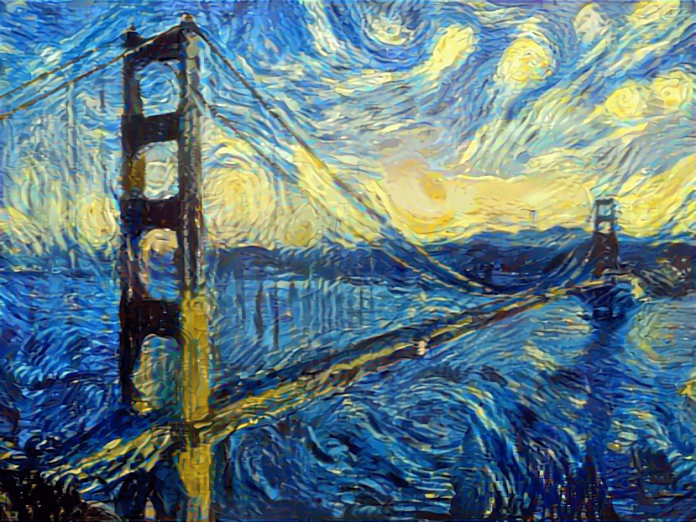
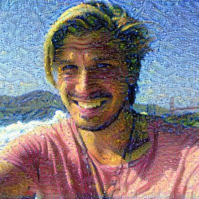
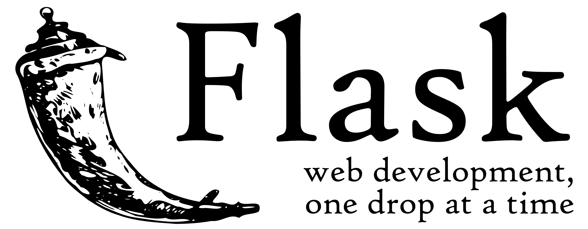
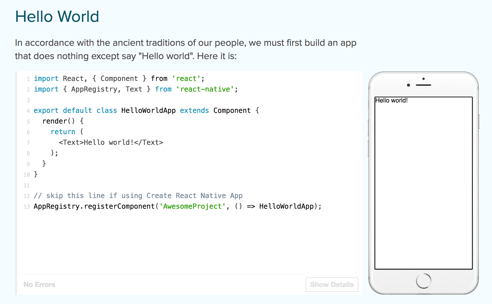
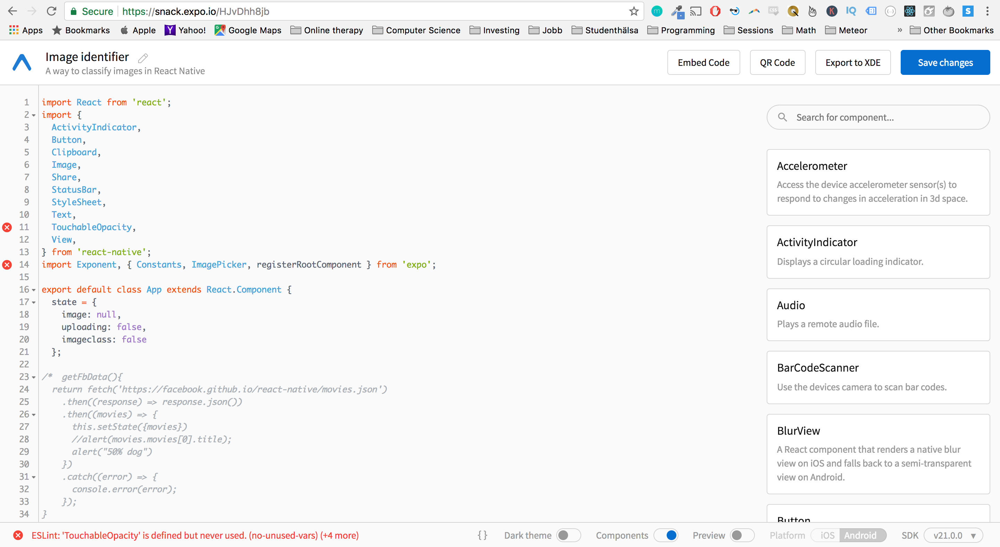

# Lesson 3
## Using neural networks for making art. 


Generative adversarial networks (GANs) are a class of artificial intelligence algorithms used in unsupervised machine learning, implemented by a system of two neural networks contesting with each other in a zero-sum game framework. They were introduced by Ian Goodfellow et al. in 2014,[1] although the idea of adversarial training dates back to Jürgen Schmidhuber in 1992.[2]

## How does a GAN learn?

A general adverserial network are two neural networks, one generator and one discriminator. The job of the generator is to create stimuli that can fool the discriminator.


The DCGAN network takes as input 100 random numbers drawn from a uniform distribution (we refer to these as a code, or latent variables, in red) 
and outputs an image (in this case 64x64x3 images on the right, in green). 
As the code is changed incrementally, the generated images do too — this shows the model 
has learned features to describe how the world looks, 
rather than just memorizing some examples.
The network (in yellow) is made up of standard convolutional neural network components, such as deconvolutional layers (reverse of convolutional layers), fully connected layers, etc.:


DCGAN is initialized with random weights, so a random code plugged into the network would generate a completely random image. However, as you might imagine, the network has millions of parameters that we can tweak, and the goal is to find a setting of these parameters that makes samples generated from random codes look like the training data. Or to put it another way, we want the model distribution to match the true data distribution in the space of images.

##  Neural style transfer


Neural style tranfer is done with Convolutional Neural Networks.

## Image style transfer

Image style transfer is defined as follow: given two images on the input, synthesize a third image that has the semantic content of the first image and the texture/style of the second. 

To work properly we need a way to (1) determine the content and the style of any image (content/style extractor) and then (2) merge some arbitrary content with another arbitrary style (merger).

'''Neural style transfer with Keras.
Run the script with:
``` bash
python neural_style_transfer.py path_to_your_base_image.jpg path_to_your_reference.jpg prefix_for_results
```


## Getting a flask application working

Here are instructions for getting last weeks Flask API working for creating an image classifier that runs on mobile


For getting your API working

```shell
git clone https://github.com/eleijonmarck/image-preprocessing.git
virtualenv env -p python3
source env/bin/activate
pip install -r image-preprocessing/cat_dog/requirements.txt
export FLASK_APP=image-preprocessing/cat_dog/application.py
flask run --host=0.0.0.0
nohup flask run --host=0.0.0.0 & `
```


## Working with React Native


Here is the code from last week React Native application.
You can simply paste it into snack.expo.io and run it on your phone using the Expo application. 
