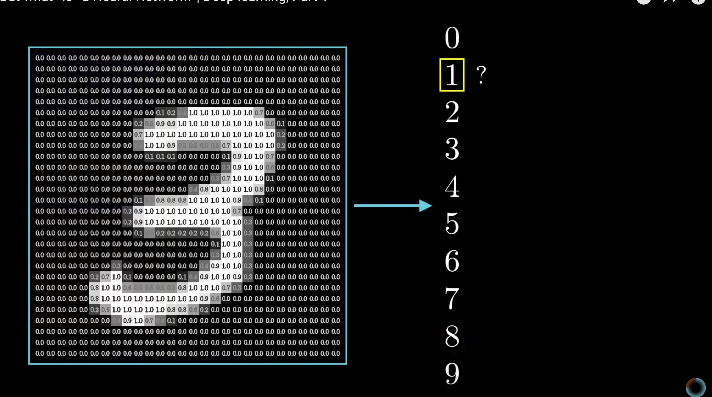
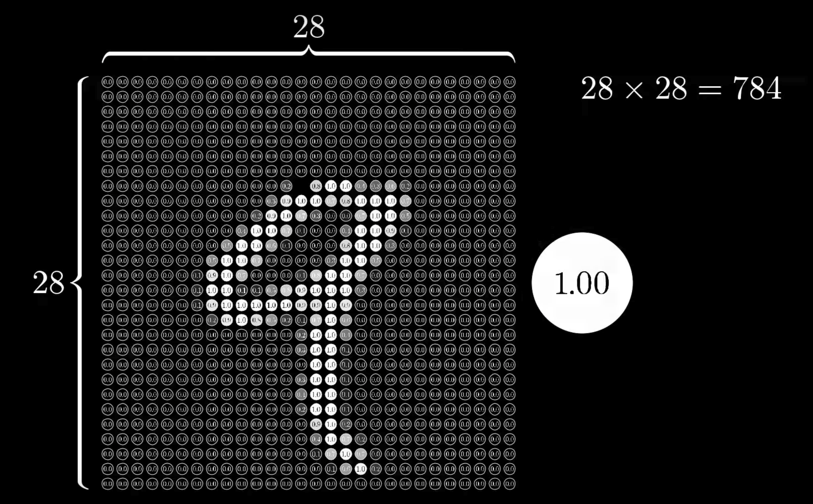
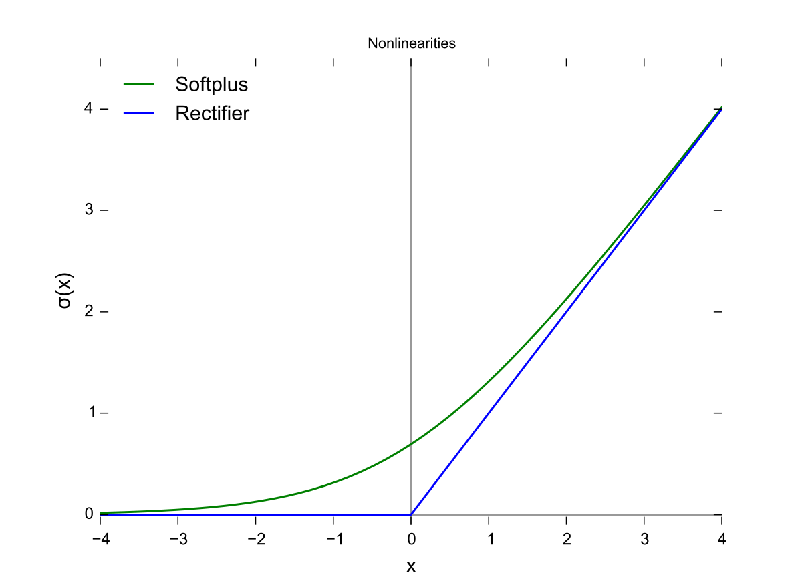
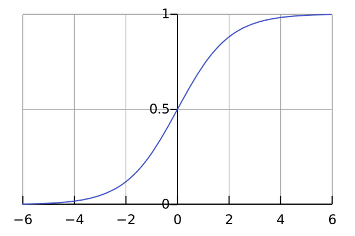

# The math of deep learning

> What I cannot create, I do not understand - Richard Feynman 

Richard Feynman who is considered one of the greatest scientists who ever lived had something scribbled on his blackboard at the time of his death.

What I cannot create I do not understand.

So this time we will create in order to understand.

# Math in deep learning
Deep learning draws math from three different sources, linear algebra, calculus and statistics. 
## Linear algebra
http://machinelearningmastery.com/linear-algebra-machine-learning/
## Calculus
https://www.umiacs.umd.edu/~hal/courses/2013S_ML/math4ml.pdf
## Statistics
http://machinelearningmastery.com/crash-course-statistics-machine-learning/
Neural network from scratch

## X and Y
X is the input to the neural network

# Backprop

## Gradient descent

## Objective functions (Loss function)

### Derivatives

### Chain rule

4 + w1 = 5

loss equals 1

4 + w2 = 3

loss equals -1

# Forward prop

## Activation function

### Sigmoid

### Relu

### Softmax

### Non-linear relationships

## Weight multiplication

w*x

## Initialisation

kx + m = y
w*x + b = y

w1*x1

w1*x1 + b

## Universal function approximator

### LSTM = Turing Machine

## Normalization

Normalizisation of input values to avoid feature scaling

Normalization of output valies to have fun

# Have fun

## Feynman lectures

